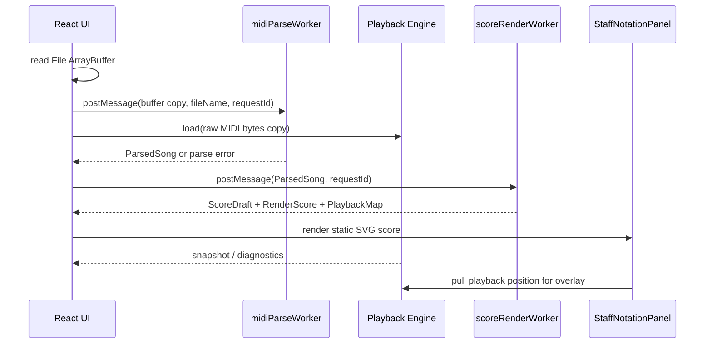

# midi-studio 系统架构与技术实现文档

本文档描述 `midi-studio` 当前功能分支的系统架构、核心数据流、模块边界和关键技术实现。它是 README、五线谱开发计划和 MuseScore 算法调研文档之间的工程总览。

相关文档：

```text
README.md
README.en.md
docs/staff-notation-development-plan.md
docs/midi-to-staff-notation-technical-design.md
docs/requirements.md
docs/alphasynth-sf2-development-plan.md
```

## 1. 系统目标

`midi-studio` 的当前核心目标是构建一个本地优先的 MIDI 练习桌面应用：

- 稳定播放本地 MIDI。
- 用 SoundFont 提供比振荡器更接近真实乐器的音色。
- 将 MIDI 还原为结构化五线谱。
- 在播放过程中同步高亮五线谱元素。
- 保持播放质量优先，避免谱面生成、布局或 React 渲染影响音频主路径。

当前已经完成：

- 本地 MIDI 导入。
- MusicXML / `.mxl` 导入，包含 worker 化解析、独立谱面建模和 fixture 校验。
- Worker 化 MIDI 解析。
- Worker 化五线谱生成和布局。
- alphaSynth + SF2 播放，带 AudioWorklet 优先和 fallback。
- 纯 Web Audio 合成器 fallback。
- 五线谱 SVG 渲染。
- 播放位置到乐谱元素的映射。
- 播放可靠性诊断。
- SQLite 设置持久化。

仍未完成：

- MusicXML 导出。
- 钢琴键盘可视化。
- PDF/PNG/SVG 导出入口。
- 离线 WAV/MP3 渲染。
- 更完整的 MuseScore 级 engraving solver。

## 2. 总体架构

应用由三层组成：

```text
Electron Main Process
  -> window lifecycle
  -> custom resource protocol
  -> settings IPC / SQLite

Preload
  -> typed, narrow bridge
  -> settings API

Renderer
  -> React application
  -> player engines
  -> MIDI parse worker
  -> score render worker
  -> staff notation UI
```

主数据流：

```text
Local MIDI file
  -> ArrayBuffer
  -> midiParseWorker
  -> ParsedSong
  -> player.load(raw MIDI bytes)
  -> scoreRenderWorker
      -> createScoreDraft()
      -> layoutScore()
      -> buildPlaybackMap()
  -> StaffNotationPanel
  -> playback overlay / click-to-seek

Local MusicXML file
  -> ArrayBuffer
  -> musicXmlParseWorker
  -> MusicXmlScoreSource + ScoreDraft + MIDI bytes
  -> player.load(raw MIDI bytes)
  -> scoreRenderWorker
      -> use MusicXmlScoreSource-derived ScoreDraft
      -> layoutScore()
      -> buildPlaybackMap()
  -> StaffNotationPanel
  -> playback overlay / click-to-seek
```

关键原则：

- 播放引擎直接加载原始 MIDI bytes，不依赖五线谱转换结果。
- `ParsedSong.notes` 是播放和谱面生成之间的共享输入模型。
- `ScoreDraft` 是乐谱语义模型，不包含像素坐标。
- MusicXML 导入会直接建出 `MusicXmlScoreSource` 和 `ScoreDraft`，播放仍通过 MIDI bytes
  交给 alphaSynth。
- `RenderScore` 是布局模型，包含系统、小节、坐标、glyph boxes。
- `PlaybackMap` 是播放时间与乐谱元素之间的索引。
- 解析和谱面生成运行在 Worker，避免主线程长任务影响播放。
- 播放 clock 不驱动 React 高频 rerender。

## 3. 目录与模块边界

```text
src/main/
  main.ts
  resources/resourceProtocol.ts
  settings/settingsDb.ts
  settings/settingsService.ts

src/preload/
  preload.ts

src/renderer/
  App.tsx
  features/
    notation/StaffNotationPanel.tsx
    settings/SettingsPage.tsx
  lib/
    midi.ts
    musicxml/
    player/
    playbackMap/
    score/
    staff/
    synthPlayer.ts
    time.ts
  workers/
    midiParseWorker.ts
    scoreRenderWorker.ts
```

### 3.1 Main Process

Main process 负责：

- 创建 Electron BrowserWindow。
- 保持 `contextIsolation: true`。
- 保持 `nodeIntegration: false`。
- 注册 `midi-studio-resource://assets/...` 自定义资源协议。
- 通过 IPC 暴露设置读写。
- 使用 SQLite 保存设置。

资源协议用于加载：

```text
public/vendor/alphasynth/alphaSynth.min.js
public/soundfonts/midiSound-2025-1-14.sf2
```

Renderer 不直接 import `public/` 资源，运行时音频资源必须走自定义协议。

### 3.2 Preload

Preload 暴露小而明确的 API：

```ts
window.midiStudio.settings.get()
window.midiStudio.settings.update(patch)
window.midiStudio.settings.getStorageInfo()
```

设计目标：

- Renderer 不获得 Node.js 文件系统能力。
- 所有持久化写入由 Main process 处理。
- API 类型在 `src/renderer/types/midiStudio.d.ts` 中声明。

### 3.3 Renderer

Renderer 负责：

- React UI。
- 播放器生命周期。
- 文件选择和导入。
- Worker 调度。
- 五线谱渲染和交互。
- 设置界面。
- 播放可靠性诊断显示。

重要边界：

- `App.tsx` 协调播放器、Worker、设置和视图状态。
- `StaffNotationPanel.tsx` 只负责乐谱视图、overlay 和点击 seek。
- `score/` 和 `staff/` 都是纯算法模块，不依赖 DOM。
- `player/` 是播放引擎抽象，不依赖五线谱模型。

## 4. 核心数据模型

### 4.1 ParsedSong

位置：

```text
src/renderer/lib/midi.ts
```

职责：

- 将 MIDI 文件解析为标准化曲目模型。
- 保留播放和谱面生成都需要的 note/meta 数据。
- 使用 tick 作为乐谱算法主时间轴，ms 作为播放同步时间轴。

关键字段：

```ts
type ParsedSong = {
  id: string;
  fileName: string;
  title: string;
  keyName: string;
  bpm: number | null;
  durationMs: number;
  trackCount: number;
  noteCount: number;
  notes: MidiNote[];
  tracks: ParsedTrack[];
  meta: ParsedMidiMeta;
};
```

`MidiNote` 同时包含：

- `startTicks` / `endTicks` / `durationTicks`
- `startMs` / `endMs` / `durationMs`
- `trackIndex` / `channel` / `program` / `isDrum`

### 4.2 ScoreDraft

位置：

```text
src/renderer/lib/score/types.ts
```

职责：

- 表达五线谱语义。
- 不包含像素坐标。
- 保留 source note ids，用于播放映射和后续 MusicXML trace。

关键结构：

```ts
type ScoreDraft = {
  id: string;
  title: string;
  ppq: number;
  durationMs: number;
  durationTicks: number;
  measures: ScoreMeasure[];
  parts: ScorePart[];
  tuplets: ScoreTuplet[];
  diagnostics: ScoreDiagnostic[];
};
```

事件类型：

```ts
type ScoreEvent = ScoreChord | ScoreRest;
```

`ScoreChord` 支持：

- notes
- sourceNoteIds
- staffIndex
- voiceIndex
- measureIndex
- durationName / dots
- tieStart / tieStop
- tupletId / timeModification

### 4.3 RenderScore

位置：

```text
src/renderer/lib/staff/types.ts
```

职责：

- 表达五线谱布局结果。
- 包含 SVG 坐标、系统、小节、staff、event boxes、beams、tuplets。
- 给 React UI 和播放 overlay 使用。

关键结构：

```ts
type RenderScore = {
  score: ScoreDraft;
  width: number;
  height: number;
  systems: RenderSystem[];
  elementBoxes: Map<string, RenderBox>;
};
```

### 4.4 PlaybackMap

位置：

```text
src/renderer/lib/playbackMap/
```

职责：

- 将 `ScoreDraft` 中的 chord segment 映射到播放时间。
- 支持当前播放位置查 active score elements。
- 支持点击乐谱元素反查 seek time。

核心接口：

```ts
findActiveScorePosition(entries, positionMs)
findSeekPositionForElement(entries, elementId)
```

## 5. MIDI 导入与 Worker 流程

### 5.1 MIDI Parse Worker

位置：

```text
src/renderer/workers/midiParseWorker.ts
```

输入：

```ts
type MidiParseRequest = {
  requestId: number;
  buffer: ArrayBuffer;
  fileName: string;
};
```

输出：

```ts
type MidiParseResponse =
  | { status: "success"; song: ParsedSong; durationMs: number }
  | { status: "error"; message: string; durationMs: number };
```

实现要点：

- 使用 `performance.now()` 记录 parse 耗时。
- 解析失败时只返回错误，不影响已存在播放器实例。
- `App` 使用 request id 防止旧 Worker 响应覆盖新文件。

### 5.2 Score Render Worker

位置：

```text
src/renderer/workers/scoreRenderWorker.ts
```

流程：

```text
ParsedSong
  -> createScoreDraft()
  -> layoutScore()
  -> buildPlaybackMap()
```

输出：

```ts
{
  score: ScoreDraft;
  renderScore: RenderScore;
  playbackMap: PlaybackMapEntry[];
}
```

Worker 化收益：

- MIDI 大文件导入时不会阻塞主线程。
- 五线谱算法迭代不会直接伤害播放调度。
- 可以独立记录 score render 耗时。

## 6. 播放系统

### 6.1 播放引擎抽象

位置：

```text
src/renderer/lib/player/types.ts
src/renderer/lib/player/createPlayer.ts
```

统一接口：

```ts
interface MidiPlaybackEngine {
  load(input: PlayerLoadInput): Promise<void>;
  play(): Promise<void> | void;
  pause(): void;
  stop(): void;
  seek(positionMs: number): void;
  setSpeed(percent: number): void;
  setMasterVolume(percent: number): void;
  dispose(): void;
  getSnapshot(): PlayerSnapshot;
  subscribe(listener): () => void;
  getDiagnostics(): PlayerDiagnostics;
  subscribeDiagnostics(listener): () => void;
}
```

当前实现：

- `AlphaSynthPlayer`
- `SynthPlayer`

### 6.2 alphaSynth + SF2 播放

位置：

```text
src/renderer/lib/player/alphaSynthPlayer.ts
```

资源：

```text
midi-studio-resource://assets/vendor/alphasynth/alphaSynth.min.js
midi-studio-resource://assets/soundfonts/midiSound-2025-1-14.sf2
```

关键实现：

- 动态加载 alphaSynth script。
- 创建 `AlphaSynthApi`。
- 设置 SoundFont。
- 优先尝试 AudioWorklet output mode。
- AudioWorklet 初始化或 ready 失败时自动 fallback 到 ScriptProcessor。
- MIDI bytes 使用 `slice(0)` 保存副本，避免 ArrayBuffer transfer 后 detach。
- `loadId` 防止旧 load 请求影响新文件。
- 通过 diagnostics 记录：
  - script load time
  - synth ready time
  - soundfont load time
  - MIDI load time
  - output mode
  - fallback reason
  - last error type

### 6.3 纯 Web Audio Fallback

位置：

```text
src/renderer/lib/synthPlayer.ts
```

用途：

- 开发/调试备用。
- alphaSynth 或 SF2 不可用时提供基础播放能力。

注意：

- 当前纯 Web Audio fallback 不是高保真主路径。
- 如果要把它作为核心播放模式，需要 AudioWorklet 或更强 ahead scheduler。

### 6.4 播放状态与 React 解耦

当前策略：

- 播放器内部维护 `PlayerSnapshot`。
- `App` 以 125ms 间隔读取 snapshot。
- 播放状态变化会进入 React。
- playing 状态下 position 不再驱动整个 App 高频 rerender。
- Footer 时间和进度条通过轻量 clock/readout 更新。
- Staff overlay 通过 `getPlaybackPosition()` 拉取播放器位置。

收益：

- React 卡顿时最多影响视觉高亮，不直接影响音频播放。
- 诊断指标也做聚合 flush，避免重新引入高频 state 更新。

## 7. 五线谱生成管线

入口：

```text
src/renderer/lib/score/createScoreDraft.ts
```

流程：

```text
ParsedSong
  -> createMeasureMap()
  -> createPartSources()
  -> quantizeNotesWithContext()
  -> assignPianoStaves()
  -> createPitchSpellings()
  -> createChordEvents()
  -> assignVoices()
  -> materializeTuplets()
  -> createStaffEvents()
  -> ScoreDraft
```

### 7.1 Measure Map

位置：

```text
src/renderer/lib/score/measureMap.ts
```

职责：

- 根据 MIDI time signature meta event 创建小节。
- 无拍号时默认 4/4。
- 拍号事件如果不在小节起点，吸附到当前小节起点并记录 diagnostic。

### 7.2 Meter Structure

位置：

```text
src/renderer/lib/score/meterStructure.ts
```

职责：

- 为每个小节生成 beat groups 和 boundaries。
- 支持 4/4、3/4、6/8 和常见复合 8 分母拍号。
- 给 duration spelling、rest splitting、beam grouping、quantization scoring 使用。

### 7.3 Quantization 2.0

位置：

```text
src/renderer/lib/score/quantization.ts
```

当前策略：

- 每小节独立搜索。
- 为每个 MIDI note 生成候选：
  - regular grid start
  - triplet grid start
  - neighbor start
  - end candidates
  - tuplet membership
  - voice hint
- 使用 beam search 保留有限状态。
- 高密度小节降级为 greedy selection，保护导入速度。

评分维度：

- start tick 距离。
- end tick 距离。
- metrical strength。
- duration dots 和 32nd 碎片成本。
- rhythm spelling 预测成本。
- tie/readability boundary 成本。
- rest gap complexity。
- tuplet slot continuity。
- voice overlap。
- voice lane。
- melody continuity。

输出：

- `quantizedStartTicks`
- `quantizedEndTicks`
- `tupletId`
- `timeModification`
- `quantizedVoiceIndex`

诊断：

- `TUPLET_GRID_DETECTED`
- `QUANTIZATION_WINDOW_FALLBACK`
- `QUANTIZATION_VOICE_OVERLAP`

当前限制：

- Tuplet 主要是 3:2 triplet。
- 未支持 5、6、7 连音。
- 未支持 human performance beat adjustment。
- 量化和 staff split 仍不是完全统一的搜索。

### 7.4 Rhythm Spelling

位置：

```text
src/renderer/lib/score/rhythmSpelling.ts
src/renderer/lib/score/durations.ts
```

职责：

- 将 chord/rest tick range 拆成可读的 notation segments。
- note 和 rest 使用不同边界策略。
- chord 不跨小节。
- 切分音跨强拍时拆 tie。
- rest 比 note 更保守，不跨强拍。
- tuplet rest 继承 `tupletId` 和 `timeModification`。

`splitRangeForRhythmSpelling()` 暴露给 quantization 使用，保证搜索阶段和最终 spelling 复用同一套可读性规则。

### 7.5 Pitch Spelling

位置：

```text
src/renderer/lib/score/pitchSpelling.ts
```

职责：

- 根据 MIDI key signature 生成调号 alter map。
- 没有 key signature 时默认 C，并记录 diagnostic。
- 使用 accidental memory 避免小节内重复临时记号。
- 根据调号、临时记号成本、旋律连续性选择 sharp/flat spelling。
- 计算 staff y position。

限制：

- 目前只支持 alter -1/0/1。
- 未实现和声功能拼写。
- 未实现自动 key detection。

### 7.6 Piano Split

位置：

```text
src/renderer/lib/score/pianoSplit.ts
```

职责：

- 对 piano program 或跨音域 track 生成 grand staff。
- 按 onset group 枚举 split point。
- 用动态规划选择每组音符的 staff assignment。

评分维度：

- treble/bass 舒适音域。
- 手跨度。
- ledger line。
- 左右手交叉。
- 相邻 split continuity。
- sustain overlap continuity。

### 7.7 Voice Split

位置：

```text
src/renderer/lib/score/voices.ts
```

职责：

- 对每个 staff 的 chords 做 measure/window search。
- 默认最多 2 voice。
- 量化阶段的 `quantizedVoiceIndex` 作为强偏好。

评分维度：

- overlap。
- same-start 不同时值 layer。
- tie count。
- rest complexity。
- melody continuity。
- voice lane。

诊断：

- `VOICE_WINDOW_UNRESOLVED`

### 7.8 Tuplet Materialization

位置：

```text
src/renderer/lib/score/createScoreDraft.ts
```

职责：

- 量化阶段生成 base tuplet candidate。
- chord 创建后按最终 staff/voice 拆分 tuplet。
- tuplet rest 在 `spellRestRangeIntoMeasure()` 中补齐。

限制：

- 当前主要支持 triplet。
- 跨谱表 tuplet 尚未完整支持。
- 泛化 tuplet 需要独立模块化。

## 8. 五线谱布局与渲染

入口：

```text
src/renderer/lib/staff/layout.ts
```

流程：

```text
ScoreDraft
  -> createSystemMeasureGroups()
  -> createSystemMeasureLayouts()
  -> createRenderParts()
  -> createRenderStaff()
  -> createRenderEvents()
  -> avoidStaffCollisions()
  -> createBeamGroups()
  -> createRenderTuplets()
  -> RenderScore
```

### 8.1 System Layout

当前系统布局：

- 固定页面宽度。
- 根据小节最小宽度和 `measuresPerSystem` 分系统。
- 若小节过密，则按系统宽度压缩。
- 根据 part/staff 数量计算系统高度。

### 8.2 Time-Slice Spacing

位置：

```text
src/renderer/lib/staff/spacing.ts
```

职责：

- 按 measure 内所有 part/staff 的事件创建 time slices。
- 每个 slice 计算 glyph profile：
  - minLeft
  - minRight
  - rhythmicWeight
- 根据 slice 间 tick distance 和 glyph profile 生成最小 spacing。
- 系统内有额外宽度时按 stretch weight 分配。

限制：

- 当前是单轮 spacing。
- collision 后不会反向扩展 measure/system。
- 未实现 MuseScore 式多轮 layout solve。

### 8.3 Glyph Metrics

位置：

```text
src/renderer/lib/staff/glyphMetrics.ts
```

当前使用轻量 glyph metric model：

- notehead
- accidental
- rest
- dot
- stem
- tie

这些 metric 用于：

- spacing profile。
- collision detection。
- element bounding boxes。

限制：

- 还不是 SMuFL 真实 glyph metrics。
- 谱号、休止符和临时记号仍部分依赖文本 glyph。

### 8.4 Collision Avoidance

位置：

```text
src/renderer/lib/staff/collisions.ts
```

当前策略：

- 同 measure 分组。
- rest voice separation。
- accidental columns。
- skyline collision pass。
- 必要时向右 shift event。

限制：

- skyline 只做局部右移。
- 不处理所有 engraving 元素层级。
- 不反推 spacing。

### 8.5 Beams

位置：

```text
src/renderer/lib/staff/beams.ts
```

当前策略：

- 按 voice 和 meter group 创建 beam group。
- eighth/16th/32nd 支持 beam count。
- 根据平均音高和 voice count 决定 stem direction。
- secondary beam 可在 meter boundary 断开。

### 8.6 React SVG View

位置：

```text
src/renderer/features/notation/StaffNotationPanel.tsx
```

职责：

- 渲染静态 `RenderScore`。
- 为 chord 绑定 `data-score-element-id`。
- 处理点击 seek。
- 渲染 diagnostics。
- 使用 `<g ref={activeOverlayRef}>` 作为播放高亮 overlay。

静态谱面通过 memo 避免播放时重绘。

### 8.7 Playback Overlay

当前策略：

- 每 125ms 拉取播放器位置。
- `findActiveScorePosition()` 查询 active ids。
- 若 active id signature 未变化，则跳过 DOM 更新。
- 若变化，则更新 overlay `innerHTML`。
- overlay metrics 写入 ref，最多 1s 聚合进入 React diagnostics。

收益：

- 播放时 React 不再跟随 position 高频 rerender。
- 高亮可以晚一点，但音频路径更安全。

## 9. 设置与持久化

位置：

```text
src/main/settings/
src/renderer/features/settings/
src/shared/settings.ts
```

职责：

- 读取用户设置。
- 更新播放模式、默认速度、主音量等。
- 保存到 SQLite。

重要约束：

- 设置写入通过 `settingsSaveQueueRef` 串行化。
- 快速 slider 或模式变更不能让旧 SQLite 响应覆盖新状态。
- 切换播放器时必须先创建并加载新引擎，再 dispose 旧引擎。

## 10. 诊断系统

### 10.1 Player Diagnostics

来源：

```text
AlphaSynthPlayer.getDiagnostics()
AlphaSynthPlayer.subscribeDiagnostics()
```

指标：

- engine
- outputMode
- fallbackReason
- alphaSynthScriptLoadMs
- synthReadyMs
- soundFontLoadMs
- midiLoadMs
- lastErrorType

### 10.2 Runtime Diagnostics

来源：

```text
App.tsx
```

指标：

- longTaskCount
- longestLongTaskMs
- midiParseWorkerMs
- midiParseError
- scoreRenderWorkerMs
- scoreRenderError
- snapshotCommitCount
- overlayUpdateCount
- overlayLookupMs
- overlayEventCount

设计原则：

- 诊断不能重新制造播放期 React 高频更新。
- overlay metrics 用 ref 累积，1s 聚合 flush。
- long task 只在 playing 状态统计。

## 11. 可靠性与性能边界

当前保护措施：

- MIDI parse worker。
- Score render worker。
- alphaSynth AudioWorklet 优先。
- ScriptProcessor fallback。
- 播放位置与 React 解耦。
- 静态谱面 memo。
- overlay signature 去重。
- 高密度小节 quantization greedy fallback。
- request id 防止旧 worker 响应覆盖新文件。
- load generation 防止旧 player load 覆盖新引擎/新 MIDI。

仍需改进：

- 纯 Web Audio fallback 仍是主线程 scheduler。
- Score worker 内部算法仍可能在极端 MIDI 上耗时较高。
- Layout/collision 仍是单轮局部解。
- 缺少正式性能 benchmark suite。

## 12. 验证策略

当前必跑：

```bash
npm run typecheck
npm run validate:score-fixtures
npm run build
```

UI 改动还需要：

```bash
npm run dev
```

并检查：

```text
http://127.0.0.1:5173
```

Score fixture validator：

```text
scripts/validate-score-fixtures.mjs
```

当前校验：

- ScoreDraft 基础结构。
- measure range。
- event id 唯一性。
- voice timeline 填满小节。
- tuplet event coverage。
- tuplet timeModification 一致性。

## 13. 分支与离线对照工具

功能分支：

```text
codex/staff-notation-pipeline
```

离线 MuseScore 对照工具已拆到独立分支：

```text
codex/musescore-comparison-fixtures
```

功能分支只保留：

- `renderScoreToSvg`
- 相关 dev 依赖

离线分支包含：

- MuseScore CLI 对照脚本。
- 视觉 diff。
- 结构 diff。
- comparison docs。

不要把离线 fixture 脚本直接合回功能分支，除非明确需要。

## 14. 后续技术路线

### 14.1 Quantization

下一步：

- Meter duration list 3.0。
- 泛化 tuplet candidate generator。
- Human performance detection。
- 用 MuseScore 对照 fixture 校准 penalty。
- 将 staff split、voice split、beam readability 纳入更统一的评分。

### 14.2 Engraving

下一步：

- 引入 SMuFL 字体。
- 使用真实 glyph metrics。
- spacing/collision 多轮求解。
- tie/slur/beam/tuplet bracket 的更正式 geometry。
- skyline 结果反推 measure width。

### 14.3 MusicXML

当前实现：

- `src/renderer/lib/musicxml/parseMusicXml.ts` 支持 `.xml` / `.musicxml` / `.mxl` 导入。
- 解析阶段保留 source voice/staff、note type/dots、tuplet/time-modification、tie 语义和
  measure attributes。
- 谱面路径通过 `toScoreDraft.ts` 直建 `ScoreDraft`，而播放路径仍通过 `toMidi.ts`
  生成 MIDI bytes。
- `scripts/validate-musicxml-fixtures.mjs` 覆盖单声部、和弦、rest、backup/forward、多
  voice、双谱表、tie、tempo、key/time change、tuplets 和 `.mxl`。

下一步：

- 从 `ScoreDraft` 导出 `score-partwise`。
- 支持 part-list、measure attributes、note/rest、voice、staff。
- 支持 tie、backup/forward、tuplet、beam。
- 使用 fixture validator 校验每小节每 voice duration sum。

### 14.4 Playback

下一步：

- 继续收集输出模式、fallback、long task、worker 耗时。
- 评估 alphaSynth 是否彻底避开 ScriptProcessor。
- 如果纯 Web Audio fallback 要成为核心模式，应迁移到 AudioWorklet 或 Worker scheduler。

## 15. 当前风险清单

- MIDI 转谱没有唯一正确答案，算法调参必须依赖 fixture。
- Tuplet 识别仍窄，复杂 tuplets 会退化成普通时值。
- Voice split 最多 2 voice，复杂复调仍可能产生 diagnostics。
- 自研 SVG 渲染还不是出版级制谱。
- MusicXML 尚未导出，当前结构化乐谱还没有外部制谱软件闭环验证。
- 播放主链路已经隔离，但任何重新引入高频 React state 的改动都可能伤害音频可靠性。

## 16. 工程约束

- 保持 `contextIsolation: true`。
- 保持 `nodeIntegration: false`。
- Renderer 不直接访问 Node 文件系统。
- Runtime audio assets 通过 `midi-studio-resource://assets/...` 加载。
- 不提交 `node_modules`、`dist`、`release`、`logs` 和本地生成 artifacts。
- 不替换 SF2，除非确认再分发权利并更新 README。
- 不让五线谱转换失败影响已经可播放的 MIDI。

## 17. 关键运行时流程

### 17.1 应用启动

启动顺序：

```text
Electron main
  -> register resource protocol
  -> create BrowserWindow
  -> load preload
  -> load renderer
  -> renderer reads settings
  -> create playback engine from saved mode
```

关键点：

- 资源协议必须早于 alphaSynth/SF2 加载可用。
- 设置读取失败不能阻塞应用启动，应使用默认设置。
- 播放器创建失败不能让 renderer 崩溃，应进入错误状态并允许用户切换播放模式。

### 17.2 打开 MIDI 文件



数据所有权：

- 播放器和 parse worker 都需要 MIDI bytes，因此打开文件后必须明确复制或保留可用副本。
- 如果某个 `ArrayBuffer` 被 transfer 到 Worker，主线程对应 buffer 会 detach。
- 当前策略是播放器加载使用独立副本，避免 Worker transfer 破坏播放输入。

竞态保护：

- 每次打开文件生成新的 request id。
- 旧 parse/score worker 响应如果 request id 不匹配，必须丢弃。
- player load 使用 generation/load id，旧 load 完成后不能覆盖新文件或新引擎。

### 17.3 播放模式切换

切换顺序必须保持：

```text
create new engine
  -> load current MIDI into new engine
  -> verify generation/current file/current mode
  -> swap active engine
  -> dispose old engine
```

原因：

- 如果先 dispose 旧引擎，新引擎加载失败时会丢掉仍可工作的播放器。
- alphaSynth 初始化和 SF2/MIDI 加载是异步过程，必须用 generation 防止晚到响应污染状态。

### 17.4 播放高亮

```text
Player internal clock
  -> getPlaybackPosition()
  -> findActiveScorePosition()
  -> compare active id signature
  -> update overlay DOM only when changed
  -> aggregate overlay metrics every ~1s
```

设计目标：

- 音频 clock 不进入 React 高频 state。
- 静态谱面不因 position 改变重绘。
- 高亮可以低频或略有延迟，但不能反向影响播放质量。

## 18. 线程模型与数据边界

| 运行位置 | 负责内容 | 不应负责内容 |
| --- | --- | --- |
| Main process | 窗口、资源协议、SQLite 设置、IPC | MIDI 解析、五线谱算法、React 状态 |
| Preload | 受控 API bridge | 暴露 Node 文件系统或任意 IPC |
| Renderer main thread | UI、播放器实例、用户交互、Worker 调度 | 大 MIDI 解析、重型 score/layout 计算 |
| MIDI parse worker | `ArrayBuffer` 到 `ParsedSong` | 播放器生命周期、DOM |
| Score render worker | `ParsedSong` 到 `ScoreDraft`/`RenderScore`/`PlaybackMap` | 音频播放、React 渲染 |
| AudioWorklet | 音频输出关键路径 | UI、谱面布局、诊断面板渲染 |

后续开发必须遵守的边界：

- 新增谱面算法优先放到 `score/` 或 `staff/` 的纯函数模块中，并由 score worker 调用。
- 新增导出能力如果只依赖 `ScoreDraft`/`RenderScore`，应避免耦合 React 组件。
- 新增诊断指标应先写入 ref 或外部轻量 store，再按低频节奏进入 React。
- 任何播放期间的 `setState` 都要先确认频率、触发范围和是否会重绘静态谱面。

## 19. 故障隔离与降级策略

### 19.1 MIDI 解析失败

期望行为：

- 显示 parse error。
- 不销毁当前仍可播放的旧曲目。
- 不启动 score worker。
- 记录 `midiParseError` 和 parse 耗时。

### 19.2 播放器加载失败

alphaSynth 链路按错误类型区分：

- alphaSynth script 加载失败。
- AudioWorklet 初始化失败。
- synth ready 超时或失败。
- SoundFont 加载失败。
- MIDI 加载失败。

降级策略：

- AudioWorklet 初始化或 ready 失败时，自动销毁当前 alphaSynth 实例并用 ScriptProcessor 重试。
- alphaSynth 整体失败时，允许用户切换到纯 Web Audio fallback。
- fallback reason 必须写入 diagnostics，不能只写 console。

### 19.3 Score worker 失败

期望行为：

- 播放器仍可播放 MIDI。
- UI 显示 score render error。
- 清理旧 score request 的 loading 状态。
- 不用不完整 `RenderScore` 覆盖上一份有效谱面，除非该谱面明确属于当前 MIDI。

### 19.4 设置写入失败

期望行为：

- UI 可以先应用用户意图。
- 保存失败应显示或记录诊断。
- 不能让较早的 SQLite 响应覆盖较新的 slider/mode 设置。

## 20. MusicXML 与导出接入设计

MusicXML 导入和导出应分开设计。

当前导入路径已经落地：

```text
MusicXML / .mxl
  -> parseMusicXmlFile()
  -> MusicXmlScoreSource
  -> toScoreDraft()
  -> RenderScore / PlaybackMap
  -> buildMidiBytes()
```

导出路径仍应从 `ScoreDraft` 生成，而不是从 `RenderScore` 或 React SVG 反推。

建议模块：

```text
src/renderer/lib/musicxml/
  types.ts
  exportMusicXml.ts
  serializeScorePartwise.ts
  validateMusicXmlDraft.ts
```

输入：

```text
ScoreDraft
```

输出：

```text
MusicXML score-partwise string
```

最小可落地范围：

- `part-list`
- `measure`
- `attributes`
- `divisions`
- `key`
- `time`
- `clef`
- `note`
- `rest`
- `duration`
- `voice`
- `staff`
- `tie`
- `notations/tied`
- `time-modification`
- `tuplet`
- `beam`
- `backup` / `forward`

关键规则：

- `ScoreDraft.ppq` 可以映射为 MusicXML `divisions`，但要确保所有 duration 都能整除。
- 多 voice 输出必须使用 `backup` 回到小节起点，再输出下一 voice。
- 同一个 `ScoreChord` 的第二个及以后音符使用 `<chord/>`。
- tie 要同时输出 playback/semantic 层面的 `<tie>` 和 notation 层面的 `<tied>`。
- tuplet rest 必须和 tuplet chord 一样写 `time-modification`。
- 导出前必须校验每个 part/staff/voice 在每个 measure 内 duration 总和合法。

当前导入实现已经验证：

- 单声部、和弦、rest。
- `backup` / `forward`。
- 多 voice、双谱表。
- tie、tempo、key/time change。
- `.mxl` 容器解包。
- 基础 tuplet / time-modification。

SVG/PNG/PDF 导出应从 `RenderScore` 走：

```text
RenderScore
  -> renderScoreToSvg()
  -> SVG file
  -> PNG/PDF renderer
```

注意：

- `renderScoreToSvg()` 属于功能分支可保留能力。
- MuseScore CLI 对照、视觉 diff 和结构 diff 属于独立离线对照分支，不默认进入主功能分支。

## 21. 性能预算与可观测指标

建议把性能目标写成可观测预算，而不是主观听感：

| 场景 | 目标 | 诊断来源 |
| --- | --- | --- |
| 打开中等 MIDI | UI 不出现明显冻结 | parse/render worker 耗时、long task |
| 开始播放 | 音频尽快进入稳定输出 | player load timings、output mode |
| 播放期间 | 主线程偶发卡顿不破坏音频 | long task、output mode、fallback reason |
| 高亮更新 | 不驱动 App 高频 rerender | overlay update count、snapshot commit count |
| 密集小节渲染 | 不横向溢出 viewport | RenderScore width、system measure widths |

后续可新增 benchmark fixtures：

```text
fixtures/perf/
  small-pop.mid
  dense-piano.mid
  orchestral-many-tracks.mid
  humanized-rubato.mid
  tuplets-and-syncopation.mid
```

每个 fixture 记录：

- parse worker ms。
- score render worker ms。
- ScoreDraft diagnostics 数量。
- RenderScore 系统数和最大系统宽度。
- playback map entry 数量。
- 播放 30 秒 long task 数量和最长阻塞。

## 22. 开发检查清单

### 22.1 修改播放相关代码

必须确认：

- 是否保持“新引擎加载成功后再 dispose 旧引擎”。
- 是否记录 output mode、fallback reason 和加载耗时。
- 是否避免播放期间高频 React rerender。
- 是否验证 alphaSynth 资源仍通过 `midi-studio-resource://assets/...` 加载。
- 是否运行 `npm run build` 并检查构建产物中 alphaSynth/SF2 文件存在。

### 22.2 修改 MIDI/Score 算法

必须确认：

- 是否在 worker 中运行。
- 是否保持 `ScoreDraft` duration timeline 合法。
- 是否更新或新增 score fixture。
- 是否运行 `npm run validate:score-fixtures`。
- 是否检查 diagnostics 类型和错误信息不会误导用户。

### 22.3 修改渲染布局

必须确认：

- 是否不会让系统宽度横向溢出。
- 是否维护 `elementBoxes`，避免播放 overlay 和点击 seek 失效。
- 是否检查 mobile/窄窗口下文字和 SVG 不重叠。
- 是否确保静态谱面不因播放位置变化重绘。

### 22.4 修改文档或项目结构

必须确认：

- 中文 README 保持在 `README.md`。
- 英文 README 保持在 `README.en.md`。
- `AGENTS.md` 与当前架构一致。
- 离线 MuseScore 对照工具不误合进功能分支。
- 新增大文件、生成目录和本地 artifacts 被 `.gitignore` 覆盖。
